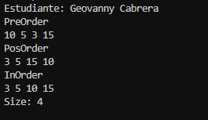
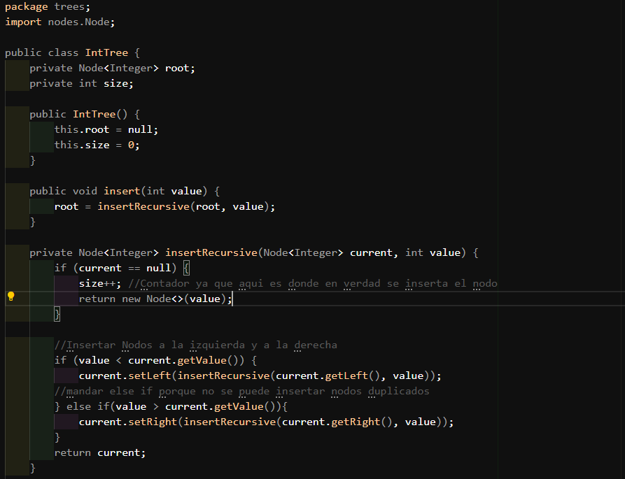
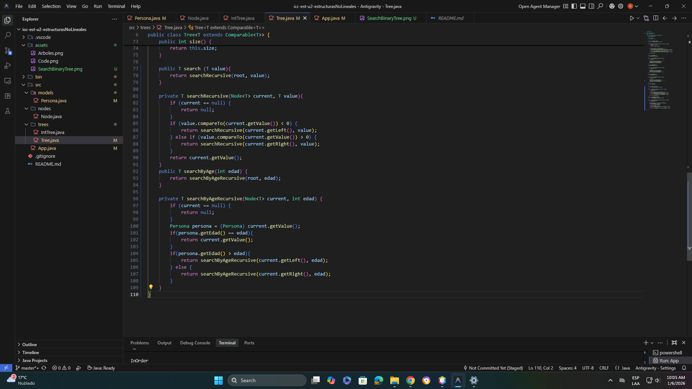
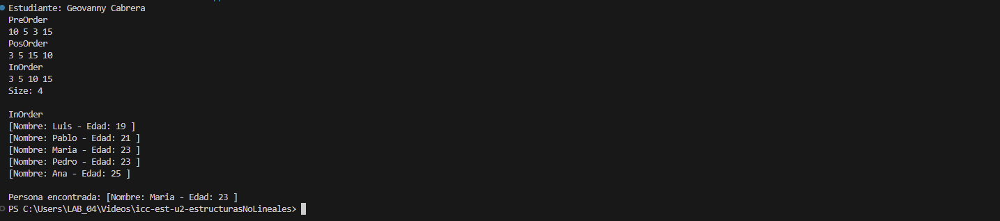
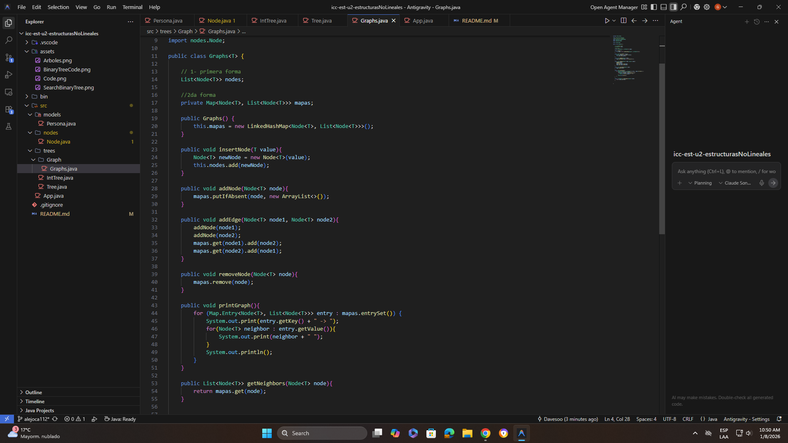
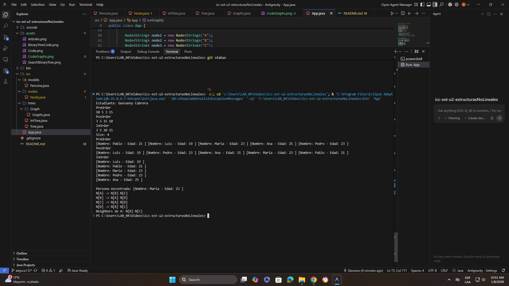
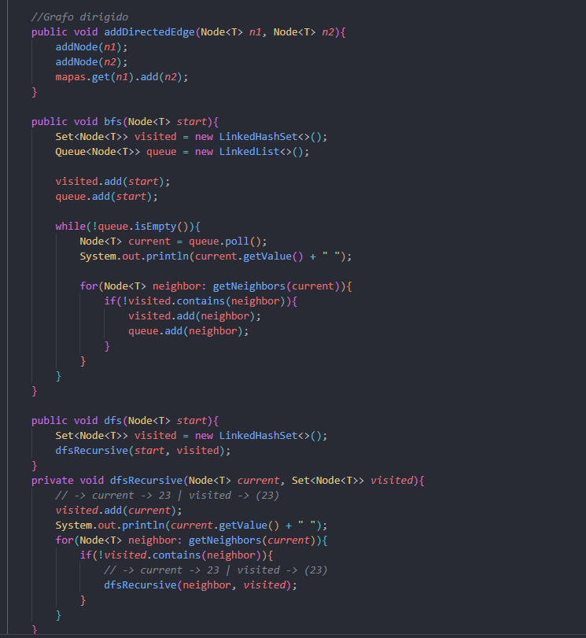
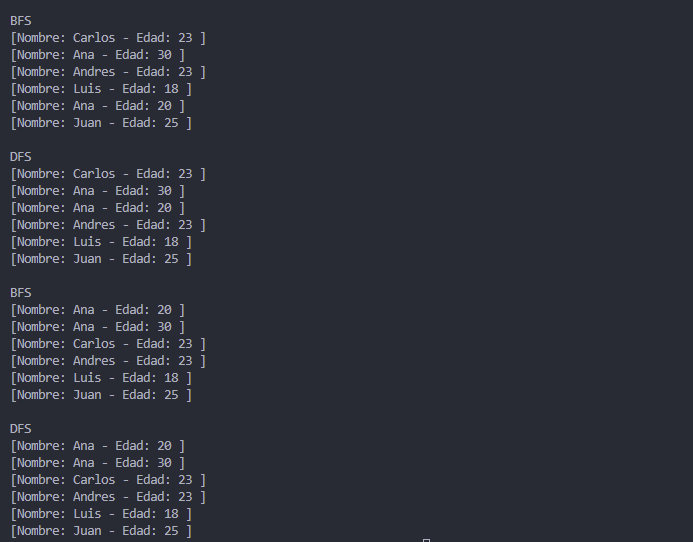

# Práctica: Estructuras No Lineales - 

## Autor
- Nombre: Geovanny Cabrera
- Carrera/Curso: Estructura de Datos

##  Nombre de la práctica - Fecha
- Práctica: Práctica de Árboles – Implementación Integers
- Fecha: 2026-1-05

## Descripción
Objetivo. Implementar un Árbol Binario de Búsqueda para enteros con recorridos PreOrder, InOrder, PostOrder y un método size() que retorne el total de nodos en complejidad O(1).

#### Entregable. Repositorio con:
Código fuente actualizado.
Evidencias en la carpeta assets/ (o equivalente).
README de la práctica actualizado.

#### Requisitos
El árbol debe permitir inserción de enteros.
Debe imprimir en consola los tres recorridos:
PreOrder
InOrder
PostOrder

Debe imprimir en consola el tamaño del árbol.
size() debe ser O(1). Para cumplirlo, el árbol debe mantener un contador interno (ej. private int size;) que se actualice en insert (y en delete si existiera).

## Evidencias
### Captura 1
Evidencia acerca del resultado en Pantalla(Consola)

### Captura 2 
Evidencia acerca del formato de codigo para contador Size(private int size)

## Práctica de Árboles – Implementación Genéricos uso de interfaces Comparable

### Fecha
2026-1-06
### Objetivo
Implementar un Árbol Binario de Búsqueda genérico en Java usando:

Node<T>
Tree<T>
Object implements Comparable<Object>
El criterio de ordenamiento no se impone en la clase Tree, sino en los objetos almacenados, cuando estos implementan la interfaz Comparable.

### Requisitos técnicos
Implementar la clase genérica:

class Tree<T>
Implementar la clase:

class Node<T>
El árbol debe permitir inserción de elementos de tipo T.

El ordenamiento debe realizarse mediante casting a Comparable dentro del árbol.

Implementar e imprimir en consola los recorridos:

InOrder
Implementaciones obligatorias
Implementación con objetos Persona
Crear la clase:

public class Persona implements Comparable<Persona>
La comparación debe basarse en el atributo edad

Usar la misma clase:

Tree<Persona>
Mostrar en consola:

InOrder

#### Evidencia 1 – Código fuente
**En esta evidencia se muestra el código fuente de la práctica de Árboles – Implementación Genéricos uso de interfaces Comparable**

#### Evidencia 2 - Salida por Consola
**En esta evidencia se muestra la salida por consola de la práctica de Árboles – Implementación Genéricos uso de interfaces Comparable**

## Práctica de Graphs-- Implementación de Grafos con Strings

### Fecha
2026-1-08
### Objetivo
#### Implementar un Grafo  en Java usando:

Node<T>
Graph<T>
### Requisitos técnicos
Implementar la clase genérica:

class Graph<T>
Implementar la clase:

class Node<T>
 
#### Implementaciones obligatorias
Implementación con objetos String
Entregable
Repositorio que contenga:

Código fuente actualizado
Carpeta assets/ con evidencias
README actualizado con la sección de esta práctica

### Evidencias Obligatorias
#### Captura 1
**En esta evidencia se muestra el código fuente de la práctica de Graphs-- Implementación de Grafos con Strings**

#### Captura 2
**En esta evidencia se muestra la salida por consola de la práctica de Graphs-- Implementación de Grafos con Strings**

## Práctica de Grafos – Recorridos BFS y DFS

### Fecha
2026-1-20

### Objetivo
Implementar los algoritmos de recorrido en grafos: Búsqueda en Anchura (BFS) y Búsqueda en Profundidad (DFS) dentro de la estructura genérica, asegurando el correcto manejo de ciclos y orden de visita.

### Requisitos técnicos
#### Implementación de BFS (Breadth-First Search)
- Implementar el método `bfs(Node<T> start)`.
- Utilizar una estructura de datos `Queue` (Cola) para gestionar la frontera de búsqueda.
- Utilizar un `Set` (específicamente `LinkedHashSet`) para registrar los nodos visitados en orden y evitar bucles infinitos.

#### Implementación de DFS (Depth-First Search)
- Implementar el método público `dfs(Node<T> start)`.
- Implementar el método privado recursivo `dfsRecursive`.
- Utilizar la pila de llamadas (recursividad) para el recorrido en profundidad.

### Implementaciones obligatorias
#### Grafo de Personas
- Instanciar un grafo de tipo `Graphs<Persona>`.
- Agregar nodos con objetos `Persona` (ej. Carlos, Ana, Luis).
- Configurar conexiones (aristas) tanto dirigidas como no dirigidas para probar la robustez de los algoritmos.

#### Ejecución en App
- Crear el método `runGraphRecorridos()` para demostrar el funcionamiento.
- Imprimir en consola el orden de visita resultante partiendo desde diferentes nodos iniciales.

### Evidencias Obligatorias
#### Captura 1
**En esta evidencia se muestra el código fuente de los métodos BFS y DFS implementados en la clase Graphs**

#### Captura 2
**En esta evidencia se muestra la salida por consola de la ejecución de los recorridos BFS y DFS**
